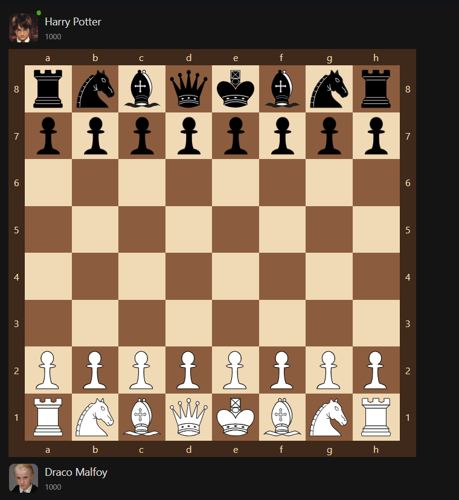
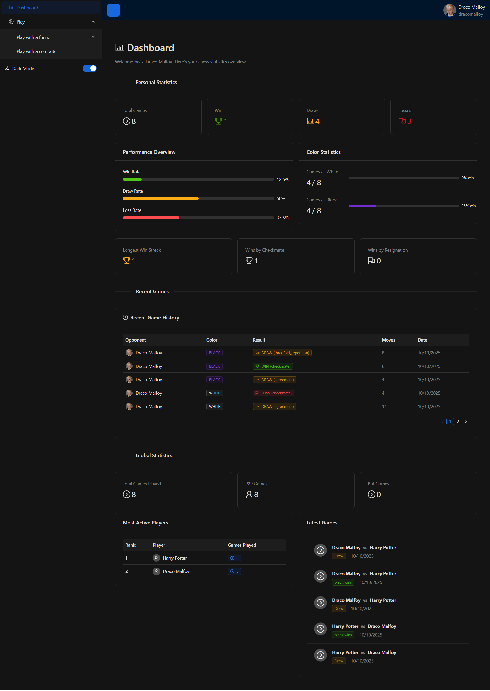
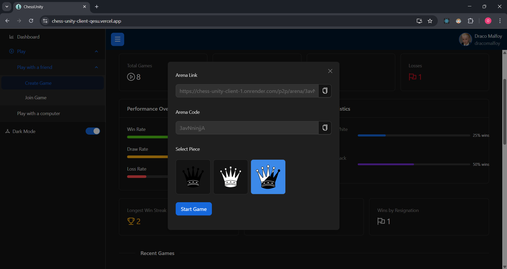
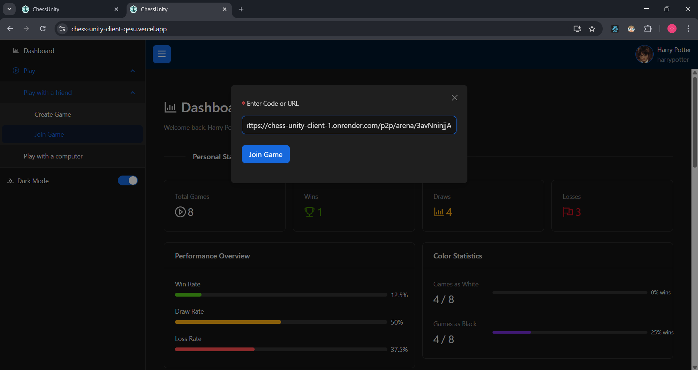

# ♟️ Chess Unity — Client (React)

Where strategy meets real‑time play. This is the React frontend for Chess Unity — a full‑stack chess experience featuring P2P rooms (Google Meet–style links/codes), AI matches powered by Stockfish, buttery‑smooth animations, and a custom chessboard built from scratch.

• Live Demo: [https://chess-unity-client-qesu.vercel.app/] • Server Repo: [https://github.com/Omishigvan99/chess_unity_server] • Client Repo: [https://github.com/Omishigvan99/chess_unity_client]

> Showcase only — not an installation guide. See the Server README for backend details.

## ✨ Highlights

-   Play with a friend via shareable room link or code (Meet‑style join)
-   Play vs. Computer with seamless Stockfish integration
-   Real‑time gameplay over Socket.IO (no refreshes, no lag)
-   Custom React chessboard with click + drag‑and‑drop moves
-   GSAP‑powered animations for pieces and board transitions
-   Ant Design UI for fast, polished interfaces
-   Redis‑backed game state caching for smooth, resilient play
-   Game autosaves to MongoDB once concluded (resume/review later)

## 🧰 Tech Stack

Frontend: React 18, Vite, React Router, Ant Design, GSAP, chess.js, Socket.IO Client, Axios

Backend (paired): Express.js, Socket.IO, MongoDB, Redis, Stockfish

DevOps: Docker, Render/Vercel (example)

## 🧩 Core Flows

1. Play with Friend

    - Create a room → share link/code → join in seconds
    - Real‑time sync via Socket.IO rooms
    - Redis caches live state for snappy updates

2. Play vs Computer
    - Stockfish generates moves server‑side
    - Client receives instant responses via sockets
    - Finalized games are stored in MongoDB

## 🎮 Chessboard Goodies

-   Built in React from first principles (not an off‑the‑shelf board)
-   Click‑to‑move and drag‑and‑drop supported
-   Legal moves, last move, checks — all highlighted
-   GSAP animations for smooth, delightful interactions

## 🚀 Why It’s Cool

• Meet‑style UX to play instantly with friends
• Smooth + resilient gameplay with Redis caching
• Chess AI when you just want a quick match
• Clean Ant Design UI and responsive layout

## 🔗 Repos

-   Client (this): [link to client repo]
-   Server (API, sockets, Stockfish, Redis, Mongo): [link to server repo]

## 🖼️ Screenshots

-   Home / Dashboard — [add image]
-   Create / Join Room — [add image]
-   In‑game (Friend vs Friend) — [add image]
-   In‑game (vs Computer) — [add image]
-   Mobile view — [add image]

## 🧱 Architecture (at a glance)

Client (React, Socket.IO Client) ⇄ Server (Express + Socket.IO) ⇄ Redis (live state)
⇄ MongoDB (final saves)
⇄ Stockfish (AI)

## 🔒 Auth (Optional)

Guest‑friendly by default. If enabled, JWT Bearer tokens are sent alongside cookies for secure API access.

## 📣 Notes

-   This README is a showcase — not a setup guide.
-   Replace “Live Demo” and repo links with your actual URLs.
-   Screenshots: add images to a `/screenshots` folder and link them above.

## 📁 Project Structure

```
chess_unity_client/
├── src/
│   ├── index.jsx              # React entry point
│   ├── App.jsx                # Main app component
│   ├── AppLayout.jsx          # Layout wrapper
│   ├── index.css              # Global styles
│   ├── Components/            # Reusable components
│   │   ├── HeaderNav.jsx      # Navigation bar
│   │   ├── MainContainer.jsx  # Main content area
│   │   ├── SideNav.jsx        # Sidebar navigation
│   │   ├── ServerLoadingPage.jsx
│   │   ├── board/             # Chessboard components
│   │   ├── Dashboard/         # Stats dashboard
│   │   ├── forms/             # Form components
│   │   ├── modals/            # Modal dialogs
│   │   └── UI/                # UI utilities
│   ├── constants/             # App constants
│   │   ├── chess.js           # Chess constants
│   │   ├── colors.js          # Color scheme
│   │   └── URL.js             # API endpoints
│   ├── context/               # React Context
│   │   ├── customTheme.context.jsx
│   │   ├── message.context.jsx
│   │   ├── modal.context.jsx
│   │   ├── notification.context.jsx
│   │   └── sidenav.context.jsx
│   ├── hooks/                 # Custom hooks
│   │   ├── useMultiRef.js     # Multi-ref management
│   │   ├── useServerHealth.js # Server health check
│   │   ├── useSocket.js       # Socket.IO connection
│   │   └── useSocketEvents.js # Socket event handling
│   ├── store/                 # State management
│   │   ├── auth.store.js      # Authentication state
│   │   └── global.store.jsx   # Global state
│   ├── utils/                 # Utility functions
│   │   ├── auth.js            # Auth utilities
│   │   ├── chess.js           # Chess utilities
│   │   ├── games.js           # Game utilities
│   │   ├── profile.js         # Profile utilities
│   │   ├── RemoteChessEvent.js # Remote event handling
│   │   └── rooms.js           # Room utilities
│   └── views/                 # Page views
├── public/                    # Static assets
│   ├── images/                # Image assets
│   ├── defaultPieces/         # Default chess pieces
│   ├── manifest.json          # PWA manifest
│   └── robots.txt             # SEO robots file
├── vite.config.ts             # Vite configuration
├── vite-env.d.ts.template     # Environment types
├── index.html                 # HTML entry point
├── package.json               # Dependencies
└── README.md                  # This file
```

## 🛠️ Installation & Setup

### Prerequisites

-   Node.js (v16 or higher)
-   npm or yarn package manager
-   Modern web browser (Chrome, Firefox, Safari, Edge)

### Steps

1. **Clone the repository**

    ```bash
    git clone <repository-url>
    cd chess_unity_client
    ```

2. **Install dependencies**

    ```bash
    npm install
    ```

3. **Configure environment variables**

    Create a `.env` file in the root directory:

    ```env
    # API Configuration
    VITE_API_URL=http://localhost:5000
    # or for production
    VITE_API_URL=https://chess-unity-server.onrender.com

    # Socket.IO Configuration
    VITE_SOCKET_URL=http://localhost:5000
    # or for production
    VITE_SOCKET_URL=https://chess-unity-server.onrender.com
    ```

4. **Start development server**

    ```bash
    npm start
    ```

    Application will open at `http://localhost:5173`

5. **Build for production**

    ```bash
    npm run build
    ```

6. **Preview production build**
    ```bash
    npm run preview
    ```

## 🎮 How to Play

### Quick Start

1. **Without Account** (Guest Mode)

    - Click "Play Now" or "New Game"
    - Choose game mode (vs Bot or vs Friend)
    - Start playing immediately

2. **Create Game Room**

    - Click "Play with Friend"
    - Copy the generated room link
    - Share link with friend via any communication channel
    - Friend clicks link to join the same room
    - Game starts when both players are ready

3. **Play Against Bot**
    - Select difficulty level (Easy, Medium, Hard)
    - Make your first move
    - Stockfish engine calculates response
    - Continue playing until checkmate or resignation

### Game Controls

-   **Select Piece**: Click on a piece to select it
-   **View Valid Moves**: Selected piece's legal moves are highlighted
-   **Move Piece**: Click on highlighted square to move
-   **Undo Move**: Use the undo button (if available)
-   **Resign**: Click "Resign" to concede the game
-   **Offer Draw**: Click "Draw" to offer a draw
-   **View Move History**: Click move history to review

## 🎨 Chessboard Implementation

### Features

-   **Custom SVG Board** - Built from scratch
-   **Piece Rendering** - Chess.js integration for piece positioning
-   **Interactive Selection** - Click to select and move pieces
-   **Visual Indicators** - Highlighting for:
    -   Selected piece (yellow)
    -   Valid moves (green)
    -   Last move (blue/orange)
    -   Check position (red)
-   **Piece Animations** - GSAP animations for smooth transitions
-   **Responsive Sizing** - Scales to container width

### Animation Details

-   **Move Animation** - 300ms smooth translation
-   **Capture Animation** - Piece fade-out effect
-   **Promotion Animation** - Smooth piece replacement
-   **Check Flash** - King position highlight

## 📊 Dashboard & Statistics

### Available Metrics

-   **Total Games** - Lifetime game count
-   **Wins/Losses/Draws** - Game outcomes
-   **Win Rate** - Percentage calculation
-   **Elo Rating** - Player strength rating
-   **Recent Games** - Last 10 games summary
-   **Performance Trend** - Win/loss over time

### Data Persistence

-   Statistics synced with backend
-   Real-time updates after each game
-   Monthly performance reset option

## 🔐 Authentication

### Session Management

-   **No Authentication Required** - Play as guest
-   **Optional Account** - Register for statistics tracking
-   **JWT Tokens** - Secure session management
-   **Email Verification** - Optional account verification

### Privacy

-   No personal information required to play
-   Guest sessions stored locally
-   Optional account linking

## 🚀 Deployment on Vercel

### Steps

1. **Connect Repository**

    - Sign in to [Vercel](https://vercel.com)
    - Click "New Project"
    - Import Git repository

2. **Configure Build Settings**

    - Framework: Vite
    - Build Command: `npm run build`
    - Output Directory: `dist`

3. **Set Environment Variables**

    - `VITE_API_URL`: Backend URL
    - `VITE_SOCKET_URL`: Socket server URL

4. **Deploy**
    - Click "Deploy"
    - Vercel automatically builds and deploys on git push

### Production Environment

```env
VITE_API_URL=https://chess-unity-server.onrender.com
VITE_SOCKET_URL=https://chess-unity-server.onrender.com
```

<!-- API Integration section intentionally removed as requested -->

## 🐛 Browser Crash Recovery

### How It Works

1. Game state saved in Redis on every move
2. Browser unexpectedly closes
3. User returns within time limit (typically 30 minutes)
4. Click "Resume Game"
5. Game state restored automatically
6. Continue playing from where you left

### Prerequisites

-   Active game session
-   Browser returns within time limit
-   Server still running

## 📱 Responsive Design

### Supported Devices

-   **Desktop** (1920x1080 and above)
-   **Laptop** (1366x768 and above)
-   **Tablet** (iPad, Android tablets)
-   **Large Mobile** (6"+ screens)

### Breakpoints

-   **Mobile**: < 480px
-   **Tablet**: 480px - 1024px
-   **Desktop**: > 1024px

## 🛣️ Future Enhancements

-   [ ] Mobile app (React Native)
-   [ ] Spectator mode for live games
-   [ ] Advanced game analysis
-   [ ] Tournament system
-   [ ] Social features (friends list, messaging)
-   [ ] Game variations and puzzle solving
-   [ ] Streaming integration
-   [ ] Offline play support
-   [ ] Custom board themes
-   [ ] Sound effects and music

## 📸 Screenshots

### Game Board



### Dashboard



### Room Creation



### Room Joining



### Player vs Computer

<video width="100%" loops muted controls>
   <source src="./screenshots/bot_gameplay.mp4" type="video/mp4">
   Your browser does not support the video tag.
</video>

**Player vs Computer** - Gameplay against Stockfish AI with real-time move calculation and smooth piece animations

### Player vs Player

<video width="100%" loops muted controls>
   <source src="./screenshots/player_vs_player.mp4" type="video/mp4">
   Your browser does not support the video tag.
</video>

### Resume Game

<video width="100%" loops muted controls>
   <source src="./screenshots/resume_gameplay.mp4" type="video/mp4">
   Your browser does not support the video tag.
</video>

## 🤝 Contributing

Contributions are welcome! Please follow these steps:

1. Fork the repository
2. Create a feature branch (`git checkout -b feature/amazing-feature`)
3. Commit changes (`git commit -m 'Add amazing feature'`)
4. Push to branch (`git push origin feature/amazing-feature`)
5. Open a Pull Request

## 📄 License

This project is licensed under the ISC License.

## 🔗 Related Repositories

-   **Backend Server**: [Chess Unity Server](https://github.com/Omishigvan99/chess-unity-server)

## 💬 Support

For issues, feature requests, or feedback:

1. Open an issue on GitHub
2. Provide detailed description
3. Include screenshots/videos if applicable

## 🙏 Acknowledgments

-   **Stockfish 17** - Chess engine
-   **Chess.js** - Chess logic library
-   **GSAP** - Animation library
-   **React** - UI framework
-   **Vite** - Build tool
-   **Vercel** - Hosting platform

---

**Built with ❤️ by the Chess Unity Team**

**Powered by Stockfish 17** - The World's Strongest Open-Source Chess Engine

**Play, Learn, and Master Chess Online** ♟️
